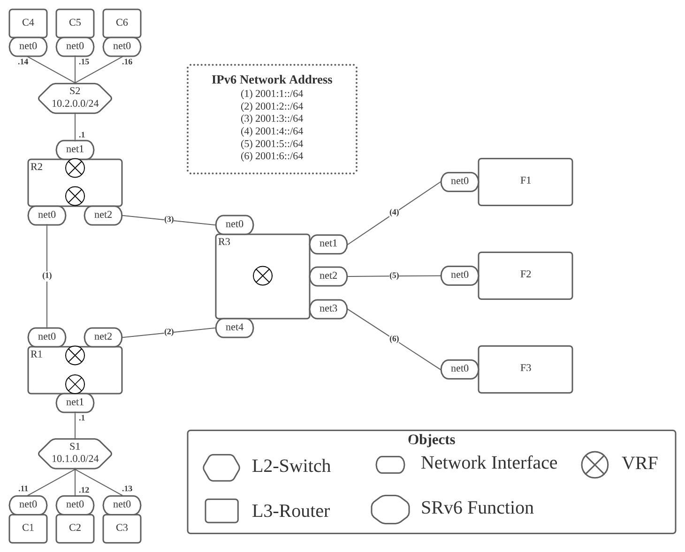

# SRv6 Configuration Hands-on

## (1) 以下のNetwork構成をNetwork Namespaceで作成してください

また, SRv6 VPNの設定は 0x01と同様の構成で設定してください.



設定後は以下のCLIを実行して, 正しくSRv6 VPNが設定されていることを確認してください
```
ip netns exec C1 ping -c1 10.2.0.14
ip netns exec C1 ping -c1 10.2.0.15
ip netns exec C1 ping -c1 10.2.0.16
ip netns exec C2 ping -c1 10.2.0.14
ip netns exec C2 ping -c1 10.2.0.15
ip netns exec C2 ping -c1 10.2.0.16
ip netns exec C3 ping -c1 10.2.0.14
ip netns exec C3 ping -c1 10.2.0.15
ip netns exec C3 ping -c1 10.2.0.16
```

## (2) 特定のHostのみ特別なPathを通るように追加で設定してください

要件
- `C1 <-> [C4,5,6]` の通信は `F1,F2` を経由するようにしてください
- `C2 <-> [C4,5,6]` の通信は `F2,F3` を経由するようにしてください
- `C3 <-> [C4,5,6]` の通信は `F3,F1` を経由するようにしてください
- このとき, ２つのFunctionに対する通信は上下の通信で対称な順番で通信してください

Hint
```
ip rule add prio 100 from 10.0.0.1 table 100
ip route add default encap seg6 mode encap segs 1::,2::,3:: dev eth0 table 100
ip route list table 100
```

設定後は以下のCLIを実行して, 正しくSRv6 VPNが設定されていることを確認してください
```
ip netns exec C1 ping -c1 10.2.0.14
ip netns exec C1 ping -c1 10.2.0.15
ip netns exec C1 ping -c1 10.2.0.16
ip netns exec C2 ping -c1 10.2.0.14
ip netns exec C2 ping -c1 10.2.0.15
ip netns exec C2 ping -c1 10.2.0.16
ip netns exec C3 ping -c1 10.2.0.14
ip netns exec C3 ping -c1 10.2.0.15
ip netns exec C3 ping -c1 10.2.0.16
```
